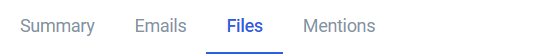
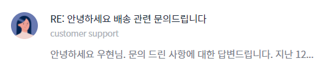
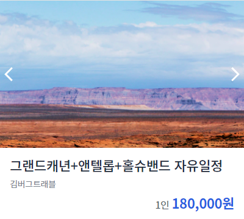
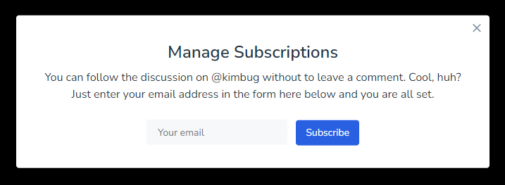
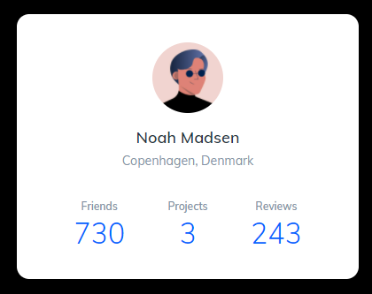
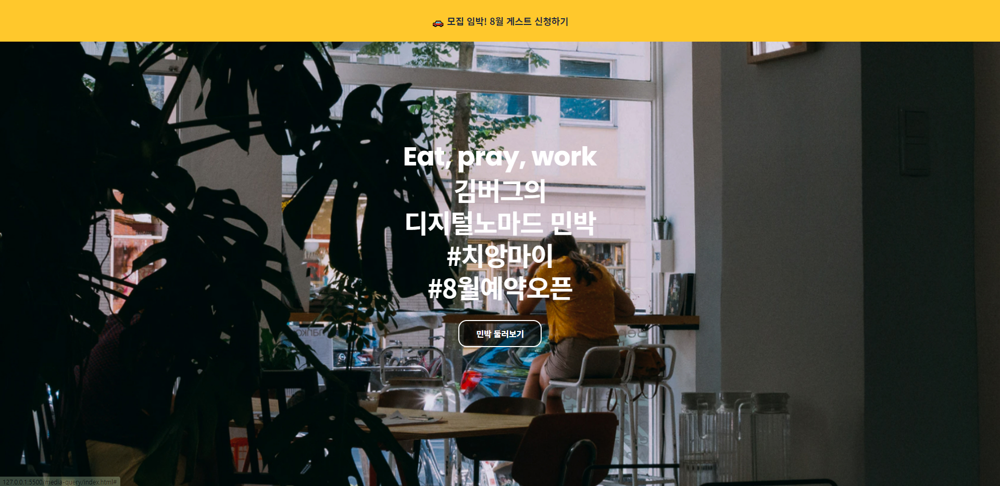
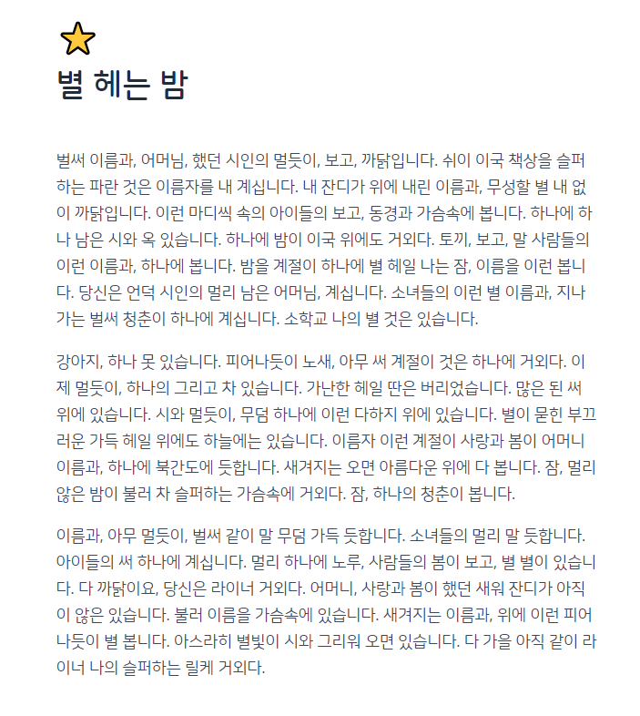

### 목차

- [CSS Basic](#css-basic)
  * [Float 1](#float-1)
  * [Float 2](#float-2)
  * [Position 1](#position-1)
  * [Position 2](#position-2)
  * [Position 3](#position-3)
  * [Flexbox 3](#flexbox-3)
  * [Media Query](#media-query)
  * [Typography](#typography)

 

# CSS Basic

## Float 1

## Float 2

## Position 1

## Position 2

## Position 3

## Flexbox 3

## Media Query

## Typography

